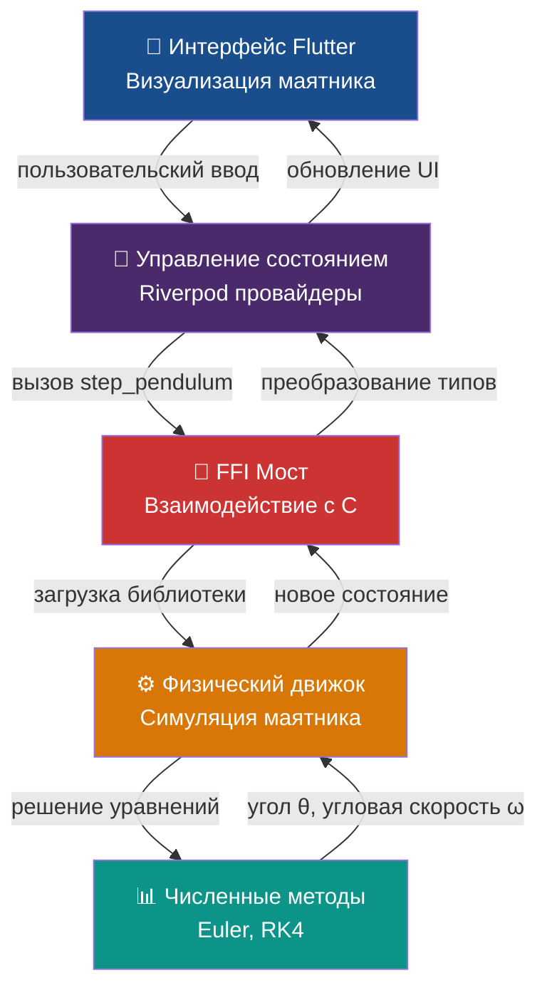
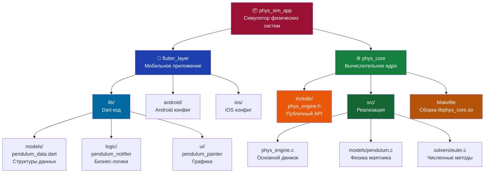

# PHYSICAL SIMULATIOM APP
Это приложение - сборник физических моделей, их симуляции и аналитические решения.
Решил делать на Flutter из-за мальтиплатформенности и на C из-за простоты легкости и простоты интеграции в Flutter.

## Архитектура потока данных


## Структура проекта


## Технологический стек
- **Frontend**: Flutter (Dart)
- **State Management**: Riverpod
- **Backend**: C (физический движок)
- **Связка**: FFI (Foreign Function Interface)

## Требования

- **Flutter SDK** 3.11.5+ — [установка](https://flutter.dev/docs/get-started/install)
- **C компилятор** (GCC, Clang или MSVC)
  - Linux: `sudo apt-get install build-essential`
  - macOS: `xcode-select --install`
- **Dart SDK** (идет вместе с Flutter)

## Как собрать и запустить

### 1. Соберите C библиотеку физического движка

```bash
cd phys_core
make clean
make
cd ..
```

Результат: `phys_core/libphys_core.so` (Linux) или `.dylib` (macOS)

### 2. Сгенерируйте FFI bindings

FFI bindings (включая класс `PhysCoreBindings`) автоматически генерируются из C заголовков:

```bash
cd flutter_layer
dart run ffigen --config ffigen.yaml
cd ..
```

**Важно**: используйте флаг `--config ffigen.yaml` чтобы использовать отдельный конфиг!

### 3. Установите зависимости Flutter

```bash
cd flutter_layer
flutter pub get
cd ..
```

### 4. Запустите приложение

```bash
cd flutter_layer
flutter run
```

Выбрать платформу:
- `-d linux` — Linux
- `-d macos` — macOS
- `-d android` — Android (требует Android Studio/Emulator)
- `-d ios` — iOS (только на macOS)

### Полный скрипт сборки (для Linux)

```bash
#!/bin/bash
set -e

echo "🔨 Сборка C движка..."
cd phys_core
make clean
make
cd ..

echo "🔗 Генерация FFI bindings..."
cd flutter_layer
dart run ffigen --config ffigen.yaml

echo "📦 Установка зависимостей..."
flutter pub get

echo "🚀 Запуск приложения..."
flutter run -d linux
```

Сохраните как `build.sh` и запустите:
```bash
chmod +x build.sh
./build.sh
```

## Решение проблем

**❌ "libphys_core.so not found"**
```bash
cd phys_core && make
```

**❌ "gcc: command not found"**
```bash
sudo apt-get install build-essential
```

**❌ "PhysCoreBindings класс не генерируется"**
```bash
cd flutter_layer
dart run ffigen --config ffigen.yaml
```

**❌ FFI не видит функции из C кода**
1. Проверьте имя функции в `phys_core/include/phys_ffi.h`
2. Убедитесь, что `ffigen.yaml` указывает на правильный заголовочный файл
3. Пересгенерируйте: `dart run ffigen --config ffigen.yaml`
4. Проверьте, что в `lib/src/generated/phys_core_bindings.dart` есть нужная функция

## Ссылки на документацию компонентов

- **[phys_core/](phys_core/)** — C физический движок
  - [phys_core/include/phys_engine.h](phys_core/include/phys_engine.h) — публичный API
  - [phys_core/src/models/pendulum.c](phys_core/src/models/pendulum.c) — физика маятника
  - [phys_core/src/solvers/euler.c](phys_core/src/solvers/euler.c) — численные методы

- **[flutter_layer/](flutter_layer/)** — Flutter приложение
  - [flutter_layer/lib/src/generated/phys_core_bindings.dart](flutter_layer/lib/src/generated/phys_core_bindings.dart) — FFI bindings (автогенерированный)
  - [flutter_layer/lib/src/models/pendulum_data.dart](flutter_layer/lib/src/models/pendulum_data.dart) — модели данных
  - [flutter_layer/lib/src/logic/](flutter_layer/lib/src/logic/) — Riverpod провайдеры
  - [flutter_layer/lib/src/ui/](flutter_layer/lib/src/ui/) — UI компоненты