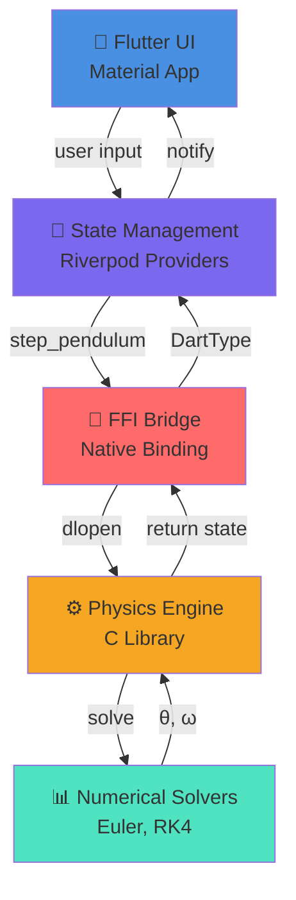

Описание проекта в целом
Архитектурная диаграмма (высокоуровневая)
Стек технологий
Как собрать и запустить
Ссылки на документацию компонентов

# PHYSICAL SIMULATIOM APP
Это приложение - сборник физических моделей, их симуляции и аналитические решения.
Решил делать на Flutter из-за мальтиплатформенности и на C из-за простоты легкости и простоты интеграции в Flutter.

